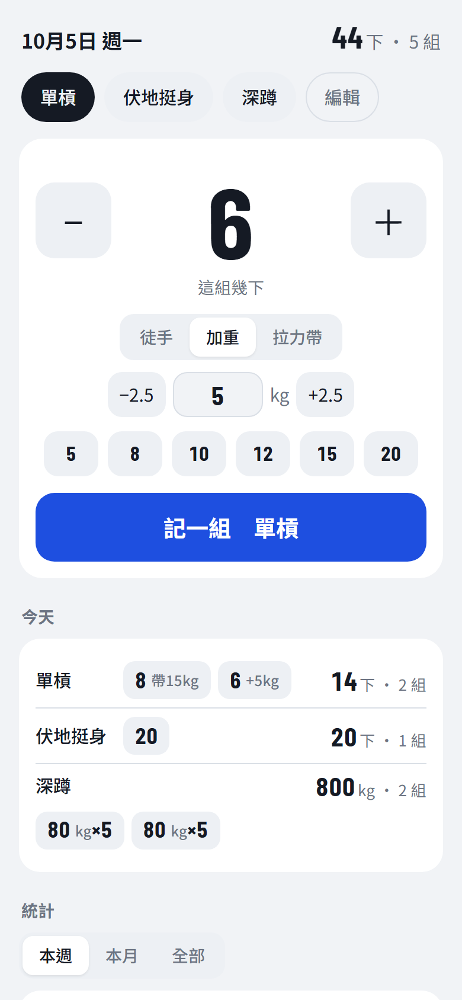

# 運動紀錄

記錄拉單槓、伏地挺身這類動作次數的手機網頁 app。也可以記加重、拉力帶輔助，以及深蹲、臥推這類重訓的重量和訓練量。

👉 https://cyril1018.github.io/workout-log/



## 開始使用

用手機打開上面的網址，**加到主畫面**，之後就能像 app 一樣從主畫面點開：

- **iPhone**：用 Safari 打開 → 分享按鈕 → 「加入主畫面」
- **Android**：用 Chrome 打開 → 右上角選單 → 「新增至主畫面」

加到主畫面後會用猴子拉單槓的圖示，打開時是全螢幕、沒有網址列。
iPhone 特別建議這樣做，原因見下面的「已知限制」。

## 資料存在哪裡

紀錄**只存在這支手機的瀏覽器裡**（localStorage），不會上傳到任何地方。
清除瀏覽器資料或換手機之前，先到頁面最下面按「匯出備份」，之後可以用「匯入備份」還原。

## 功能

- **記一組**：選動作、調次數，按「記一組」
- **負重**：可選徒手、加重（+kg）或拉力帶（輔助 kg），每個動作會記住上次用的
- **重訓**：在「編輯」把動作設成「重量」類，就只填重量（有 ±2.5kg 按鈕），每組顯示成 `60kg×5`，
  統計和長條圖改看訓練量（重量 × 次數）和最重。自重動作的加重不算進訓練量。
- **修改／刪除**：點任何一組（今天或之前的都可以）就能改次數、重量，或刪掉
- **改名**：在「編輯」改動作名稱，之前記的組和統計會一起改成新名稱
- **統計**：本週／本月／全部的總次數（重量類是總量）、組數、天數，以及最近 14 天的長條圖
- **離線可用**：打開過一次後，沒有網路也能開、也能記
- **備份**：匯出／匯入 JSON 備份，或匯出 CSV 用試算表看

## 已知限制

- **iPhone Safari 7 天沒打開，資料可能被清掉**：這是 Safari 的隱私機制。加到主畫面後打開的不受這個限制。
- **不會在裝置之間同步**：手機和電腦各存各的，要搬資料請用匯出／匯入備份。
- **清除瀏覽器資料、用無痕模式**都會讓紀錄不見，或存不起來。
- 重量只有公斤（kg），沒有磅（lb）。

## 檔案

| 檔案 | 用途 |
|---|---|
| `index.html` | 畫面結構 |
| `style.css` | 樣式（含深色模式） |
| `app.js` | 程式邏輯 |
| `sw.js` | Service Worker：每次打開都抓最新版，離線時用上次的版本 |
| `manifest.webmanifest` | 加到主畫面用的名稱、圖示、顯示方式 |
| `icons/` | app 圖示（由 `tools/make-icons.js` 產生，不要手改） |
| `tools/make-icons.js` | 把猴臉加上單槓組成圖示，輸出各尺寸 PNG：`node tools/make-icons.js` |
| `tools/monkey-face.svg` | 圖示用的猴臉（Noto Emoji，授權見 `tools/NOTO-EMOJI-LICENSE.txt`） |
| `tests/` | Playwright 測試，`serve.js` 是測試用的本機伺服器 |
| `docs/screenshot.png` | README 用的截圖（假資料） |

不需要建置工具，以上檔案直接放上 GitHub Pages 就能跑。

## 開發

需要 Node.js。

```sh
npm install
npx playwright install chromium   # 第一次才需要
npm test
```

測試會自動在 `127.0.0.1:4173` 開一個本機伺服器，跑完就關掉。

## 發布

push 到 `main`，GitHub Pages 大約一分鐘內會更新。

改了 `app.js` 或 `style.css` 的話，要把 `index.html` 裡兩個 `?v=` 版本號都加 1（例如 `app.js?v=4` → `app.js?v=5`）。
app 是比對這個版本號來判斷有沒有新版，沒改的話，開著的手機不會跳出「有新版本」的提示。

## 致謝

圖示的猴臉來自 Google 的 [Noto Emoji](https://github.com/googlefonts/noto-emoji)（🐵 U+1F435），採 SIL Open Font License 1.1 授權。
